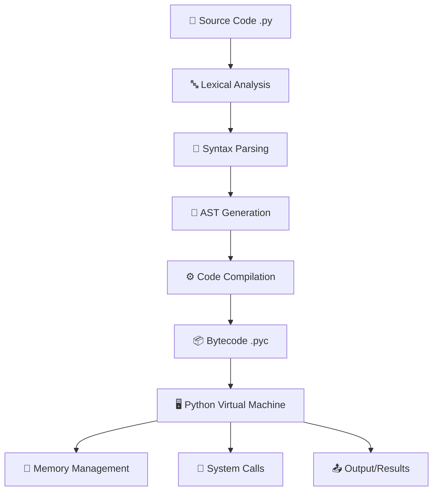

# 🐍 Python Code Execution: Backend Process & Troubleshooting Guide

## 📋 Table of Contents

1. [Python Execution Model](#python-execution-model)
2. [Compiler vs Interpreter Behavior](#compiler-vs-interpreter-behavior)
3. [Backend Execution Process](#backend-execution-process)
4. [Common Issues & Solutions](#common-issues--solutions)
5. [Performance Optimization](#performance-optimization)

---

## 🔧 Python Execution Model

### 🎯 Overview

Python is a **hybrid language** that combines both compilation and interpretation:

- **Source Code** (.py) → **Bytecode** (.pyc) → **Python Virtual Machine (PVM)**

### ⚙️ Execution Stages

#### Stage 1: Lexical Analysis & Parsing

```
Source Code → Tokens → Abstract Syntax Tree (AST)
```

- **Tokenization**: Breaks code into meaningful units
- **Parsing**: Creates AST representation
- **Syntax Checking**: Validates code structure

#### Stage 2: Compilation to Bytecode

```
AST → Bytecode Instructions → .pyc files
```

- Converts AST to platform-independent bytecode
- Stores compiled bytecode in `__pycache__` directory
- Reuses bytecode if source hasn't changed

#### Stage 3: Interpretation

```
Bytecode → Python Virtual Machine → Machine Code
```

- PVM interprets bytecode instructions
- Executes one instruction at a time
- Manages memory and system calls

---

## 🔄 Compiler vs Interpreter Behavior

### 📊 Comparison Table

| Aspect              | Compiler                     | Interpreter         | Python             |
| ------------------- | ---------------------------- | ------------------- | ------------------ |
| **Processing**      | 🏗️ Entire program at once    | 📝 Line by line     | 🔄 Hybrid approach |
| **Output**          | 💾 Machine code              | ⚡ Direct execution | 🎯 Bytecode        |
| **Speed**           | 🚀 Fast execution            | 🐌 Slower execution | ⚖️ Moderate speed  |
| **Error Detection** | 🔍 Compile-time              | 🚨 Runtime          | 🎭 Both phases     |
| **Memory Usage**    | 📈 Higher during compilation | 💡 Lower overall    | 🎯 Optimized       |

### 🐍 Python's Unique Approach

#### ✅ Compilation Phase

- **When**: Import time or first execution
- **What**: Converts .py to .pyc bytecode
- **Where**: `__pycache__` directory
- **Benefits**: Faster subsequent executions

#### ✅ Interpretation Phase

- **When**: Every execution
- **What**: PVM interprets bytecode
- **How**: Instruction by instruction
- **Benefits**: Platform independence

---

## 🏗️ Backend Execution Process

### 🔍 Detailed Execution Flow



### 🧠 Python Virtual Machine (PVM) Components

#### 📚 Core Components

- **🔄 Execution Engine**: Interprets bytecode
- **📊 Call Stack**: Manages function calls
- **🗃️ Namespace**: Handles variable scope
- **🧹 Garbage Collector**: Memory management
- **📋 Exception Handler**: Error management

#### ⚡ Bytecode Instructions Examples

```python
# Source Code
x = 10 + 20

# Corresponding Bytecode
LOAD_CONST    0 (10)
LOAD_CONST    1 (20)
BINARY_ADD
STORE_NAME    0 (x)
```

### 🔧 Optimization Mechanisms

#### 📈 Runtime Optimizations

- **Constant Folding**: Pre-calculates constants
- **Peephole Optimization**: Optimizes bytecode
- **Interning**: Optimizes string storage
- **Caching**: Reuses compiled bytecode

---

## 🚨 Common Issues & Solutions

### ❌ Syntax Errors

#### 🔍 Issue: Invalid Syntax

```python
# Problem
if x = 10:  # Using = instead of ==
    print("Equal")
```

#### ✅ Solution

```python
# Fix
if x == 10:  # Correct comparison operator
    print("Equal")
```

#### 🛠️ Prevention Tips

- Use proper IDE with syntax highlighting
- Enable linting (pylint, flake8)
- Regular code reviews

### ❌ Import Errors

#### 🔍 Issue: Module Not Found

```bash
ModuleNotFoundError: No module named 'requests'
```

#### ✅ Solutions

```bash
# Install missing package
pip install requests

# Check Python path
python -c "import sys; print(sys.path)"

# Virtual environment setup
python -m venv myenv
source myenv/bin/activate  # Linux/Mac
myenv\Scripts\activate     # Windows
```

### ❌ Memory Issues

#### 🔍 Issue: Memory Leaks

```python
# Problem: Circular references
class Node:
    def __init__(self):
        self.ref = self  # Circular reference
```

#### ✅ Solution

```python
# Fix: Proper cleanup
import weakref

class Node:
    def __init__(self):
        self._ref = None

    def set_ref(self, node):
        self._ref = weakref.ref(node)
```

### ❌ Performance Issues

#### 🔍 Issue: Slow Execution

```python
# Problem: Inefficient loops
result = []
for i in range(1000000):
    result.append(i * 2)
```

#### ✅ Solution

```python
# Fix: List comprehension
result = [i * 2 for i in range(1000000)]

# Or use NumPy for numerical operations
import numpy as np
result = np.arange(1000000) * 2
```

### 🔧 Debugging Tools & Techniques

#### 🛠️ Built-in Tools

- **pdb**: Python debugger
- **dis**: Bytecode disassembler
- **profile/cProfile**: Performance profiling
- **traceback**: Error tracing

#### 📊 Example: Bytecode Analysis

```python
import dis

def example_function():
    x = 10
    y = 20
    return x + y

# View bytecode
dis.dis(example_function)
```

---

## 🚀 Performance Optimization

### ⚡ Speed Optimization Strategies

#### 1️⃣ **Use Built-in Functions**

```python
# Slow
result = []
for item in data:
    if condition(item):
        result.append(item)

# Fast
result = list(filter(condition, data))
```

#### 2️⃣ **Leverage NumPy for Numerical Operations**

```python
# Slow: Pure Python
total = sum([x**2 for x in range(1000000)])

# Fast: NumPy
import numpy as np
arr = np.arange(1000000)
total = np.sum(arr**2)
```

#### 3️⃣ **Use Appropriate Data Structures**

```python
# Slow: List for membership testing
items = [1, 2, 3, 4, 5]
if x in items:  # O(n) operation

# Fast: Set for membership testing
items = {1, 2, 3, 4, 5}
if x in items:  # O(1) operation
```

### 💾 Memory Optimization

#### 🔄 Generators vs Lists

```python
# Memory-intensive
squares = [x**2 for x in range(1000000)]

# Memory-efficient
squares = (x**2 for x in range(1000000))
```

#### 🗑️ Proper Resource Management

```python
# Good practice: Context managers
with open('file.txt', 'r') as f:
    content = f.read()
# File automatically closed
```

---

## 🎯 Best Practices Summary

### ✅ Development Practices

- **📝 Write clean, readable code**
- **🧪 Test thoroughly with unit tests**
- **📊 Profile before optimizing**
- **🔧 Use virtual environments**
- **📖 Follow PEP 8 style guidelines**

### 🛠️ Debugging Practices

- **🔍 Use proper debugging tools**
- **📋 Log appropriately**
- **🚨 Handle exceptions gracefully**
- **📈 Monitor memory usage**
- **⚡ Profile performance bottlenecks**

### 🔐 Security Practices

- **🛡️ Validate input data**
- **🔒 Use secure coding practices**
- **📦 Keep dependencies updated**
- **🔍 Regular security audits**

---

## 📚 Additional Resources

### 🔗 Official Documentation

- [Python Official Documentation](https://docs.python.org/)
- [Python Developer's Guide](https://devguide.python.org/)

### 🛠️ Useful Tools

- **IDEs**: PyCharm, VS Code, Sublime Text
- **Linters**: pylint, flake8, black
- **Profilers**: cProfile, line_profiler, memory_profiler
- **Testing**: pytest, unittest, coverage

### 📊 Performance Analysis

```bash
# Profile your code
python -m cProfile -o profile_output.prof your_script.py

# Memory profiling
python -m memory_profiler your_script.py

# Line-by-line profiling
kernprof -l -v your_script.py
```

---

_This guide covers the essential aspects of Python code execution, from the underlying mechanics to practical troubleshooting solutions. Use it as a reference for understanding and optimizing your Python applications._
